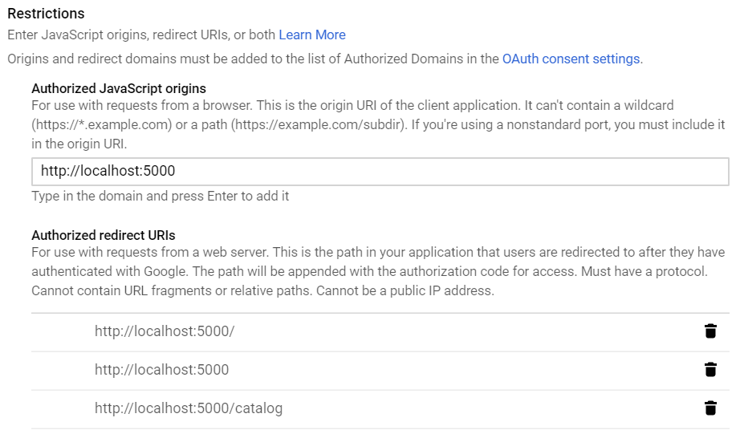

# Udacity Full Stack Item Catalog

Item catalog project of the Udacity Full Stack Web Developer Nanodegree Program.<br>
A full stack web application that provides a list of sports items within a variety of categories. The items are managed in a SQLite database. The application also provides a user authentication system utilizing Google sign-in as well as Facebook sign-in. Signed-in users can add, edit and delete items.

## __Getting Started__

The following instructions will get your copy of the project up and running on your local machine for development and testing purposes.

## Python prerequisites

You need [Python 3](https://www.python.org/downloads/) to run the application. The application was developed and tested with Python 3.7.<br>
Furthermore, several packages must be installed:
```
pip install "httplib2==0.13.1"
pip install "Flask==1.1.1"
pip install "oauth2client==4.1.3"
pip install "pipenv==2018.11.26"
pipenv install "requests==2.22.0"
pip install "SQLAlchemy==1.3.6"
pip install "bleach==3.1.0"
```

## Preparing the OAuth 2.0 mechanism

For the Google and Facebook sign-in an OAuth 2.0 mechanism is used. You need to obtain credentials (such as ID and secret) from both Google and Facebook and insert them into the code for the application to work.

### __Preparations for Google sign-in__

1. Create a client ID and secret

   Using [Google Chrome](https://www.google.com/chrome/) browser is recommended for the following, since the site functionalities are a little wonky with e.g. Microsoft Edge.<br>
   Go to https://console.developers.google.com and sign in.<br>
   Create a new project.<br>
   Make sure that your project is selected:<br>
   
   
   Go to _Navigation Menu → APIs & Services → Credentials_:<br>
   
   
   Create an OAuth client ID:<br>
   
   
   Edit the OAuth consent screen:<br>
   
      
   → Change the application name to _Elisabeth's Sports Item Catalog_<br>
   → Customize the consent screen as you see fit<br>
   → then save the changes<br>
   
   Select _Web Application_:<br>
   
   
   Fill in the Authorized origins and redirect URIs as shown in the picture below:<br>
   
   
   → don't forget to press ENTER after typing in an URI, otherwise it will not be added<br>
   → then save the changes<br>
   
   There will be a popup that shows the created client ID and client secret; confirm the popup.

2. Insert your credentials into the code

   Download the credentials as JSON file:<br>
   
   
   Rename the JSON file to *client_secrets.json* and save it in the same directory as *application.py*.<br>
   Open the JSON file to see the client ID and the client secret (among other key-value pairs); for the following, you can copy-paste those values.<br>
   In the *templates* directory, open *login.html*.<br>
   In line 28, insert your client ID (see JSON file).


More information about OAuth 2.0 with Google can be found [here](https://developers.google.com/identity/protocols/OAuth2).

### __Preparations for Facebook sign-in__

1. Create an app ID and secret

   Go to https://developers.facebook.com/ and sign in.<br>
   Create a new application by going to _My Apps → Create App_:<br>
   
   
   Give your new app the Display Name _Elisabeth's Sports Item Catalog_ and click _Create App ID_.<br>
   Create a test app from your new application:<br>
   
   
   Under the section _Add a Product_ find _Facebook Login_ and click _Set up_:<br>
   
   
   Choose _Web_ as the app's platform:<br>
   
   
   In the settings, specify the Site URL:    http://localhost:5000
   
   Then go to _Settings → Basic_:<br>
   
   
   Change the Display Name to _Elisabeth's Sports Item Catalog_.<br> 
   At the top of the basic settings, find the _App ID_ and the _App Secret_.

2. Insert your credentials into the code

   The _app_ directory contains a template file called *fb_client_secrets.json*.<br>
   Open the JSON file and add your app ID in line 3 and your app secret in line 4.<br>
   In the *templates* directory, open *login.html*.<br>
   In line 175, insert your app ID.<br>

More information about OAuth 2.0 with Facebook can be found [here](https://developers.facebook.com/docs/facebook-login/).

## __Running the application__

Within the _app_ directory find _application.py_.<br>
Run _application.py_.<br>
Open your browser ([Google Chrome](https://www.google.com/chrome/) was used for development and testing).<br>
Visit http://localhost:5000 to see the item catalog.<br>

## __Author__

**Elisabeth Strunk**<br>
 https://github.com/ElisabethStrunk<br>
 https://www.linkedin.com/in/elisabeth-strunk/

## Acknowledgments

* Huge thanks to [Lorenzo Brown](https://github.com/lobrown) who authored the Udacity course this project is based upon
* Many thanks to [Billie Thompson](https://gist.github.com/PurpleBooth) who provides a [template](https://gist.github.com/PurpleBooth/109311bb0361f32d87a2) for readmes that I used to write this readme

